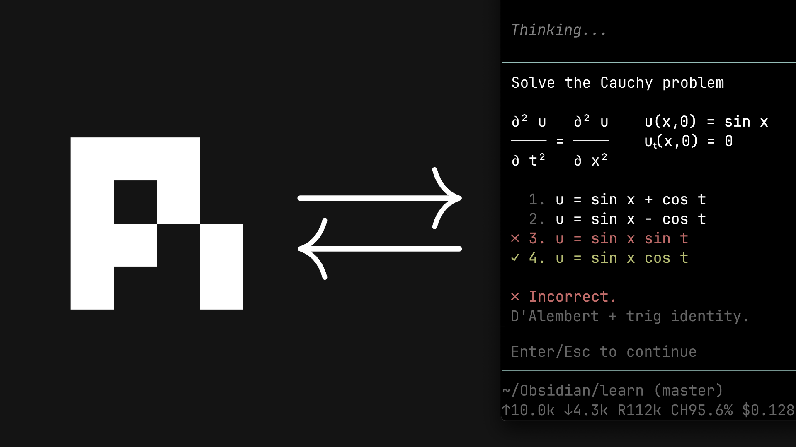

# learn

[](https://www.youtube.com/watch?v=kzcI5F4tGiU)

My AI learning system from this video: [How I Use AI to Learn Things](https://www.youtube.com/watch?v=kzcI5F4tGiU).

This is a personal system I built for myself, shared as-is. Built as a pi configuration: the teaching philosophy encoded in a skill, a few small extensions, and agent definitions.

## What's in it

- `skills/teach/` — the philosophy and the process
- `skills/visualize/` — adds a correct, minimal diagram to a lesson when an idea is clearer as a picture
- `extensions/ask-user-question/` — the agent asks you questions through a UI popup
- `extensions/quiz/` — graded questions with instant feedback (✓/✗, correct answer, explanation)
- `extensions/md-log/` — link one markdown transcript file to the session
- `extensions/learn-notes/` — turn a learning prompt into a linked Obsidian topic hub and lazily created concept notes
- `extensions/visual-tools/` — tools for visualization subagents
- `agents/` — local-first `researcher`, hosted `deep-researcher`, `svg-maker`, and `mermaid-maker`: the subagents the system delegates to

## Install

This repo **is** a `.pi` directory. From your learning project's root:

```bash
git clone https://github.com/amosblomqvist/learn .pi
```

Then open pi in that directory. (Or copy the pieces you want into your existing project config.)

## Requirements

- [pi](https://github.com/earendil-works/pi)
- A subagent implementation, so the system can spawn the researcher and the visual makers. Recommended: [pi-interactive-subagents](https://github.com/amosblomqvist/pi-interactive-subagents) (tmux only). With it, everything works out of the box. Any other implementation works too, but expect to adapt the agent definitions, e.g. `agents/researcher.md` lists `safe_bash` in its tools, which is specific to that extension.
- `ask-user-question` — use the copy bundled here. If your setup already has an `ask-user-question` extension, use **this** one in its place. Popups from different extensions serialize through a shared UI lock, which only works when it's the same implementation.

## Notes

You can run the system without subagents. The main session does the teaching. You just lose the researcher (truth verification) and the generated visuals.

The teaching workflow uses the local Ollama `researcher` for routine work. It
selectively escalates unresolved, conflicting, high-stakes, or unusually broad
questions to the OpenRouter-backed `deep-researcher`; routine research does not
call both. You can invoke either explicitly from Pi inside tmux:

```text
/subagent researcher <question>
/subagent deep-researcher <question and any unresolved local findings>
```

The hosted fallback and both visual makers require locally configured
OpenRouter authentication. The visual makers route Claude through OpenRouter;
the effective Learn configuration never calls the Anthropic provider directly.
Both researchers use the globally managed Brave-backed `web_search` tool; its
key is stored locally outside Git. `web_fetch` does not replace search
discovery.

The teaching skill is written for one learner (me). Edit the skill to fit how you learn best.

## Structured Obsidian notes

Start a lesson and its notebook together from Pi:

```text
/learn-notes start I want to understand how transformers turn text into predictions
```

The text after `start` is a learning prompt, not a filename. Pi derives a
concise topic title and provisional goal, then creates only a topic hub beneath
`Learn/` in the current vault. Probing and planning remain in that hub. Once the
dependency plan is ready, Pi registers its concept notes but creates each file
only when teaching reaches that concept after plan approval.

The agent normally handles routing. Manual recovery and inspection commands are:

```text
/learn-notes status
/learn-notes list
/learn-notes new Concept title
/learn-notes use concept-id
/learn-notes close
/learn-notes stop
```

Running `start` without text reuses the most recent user prompt in the active
branch. `stop` stops structured logging but never deletes the generated files.
The older `/md-log <existing-file>` command remains available when a literal
single-file transcript is preferable.
